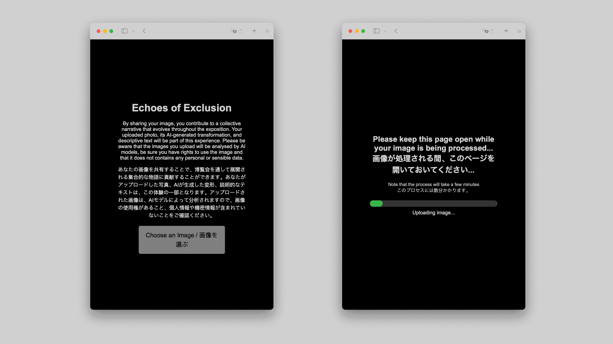

# Echoes of exclusion
The interactive installation was developed during the course _Prototyping Interactive Installations_ of the [Master of Arts in Interaction Design](https://maind.supsi.ch) in 2024, held by [Leonardo Angelucci](https://www.leonardo-angelucci.ch/) with the assistance of [Matteo Subet](https://zumat.ch).

The project developed by [Amina Fatou Cissè](https://linekdin.com), [Cathrine Hansen](https://linekdin.com) and [Hannah Kastrytsa](https://linekdin.com), implemented and refined by [Matteo Subet](https://zumat.ch), wants to explore different Generative AI systems in order to find specific patterns within the machine thoughs. Specifically, the installation let the user to explore image description, image generation and voice cloning through different Generative AI models such as LLaVa v1.6 Large Language and Vision Assistant, that uses Mistral 7B LLM for answering, FLUX.1 [dev] 12B Image generator, and Coqui XTTS-v2 Multilingual Text To Speech Voice Cloning.

## General structure
The overall project's structure is based on [Next.js](https://nextjs.org) and hosted on [Vercel Platform](https://vercel.com). Serving as fronted and backend at the same time to reduce complexity in infrastructure. To let the installation be plug and play, it was developed as well a script that runs via Linux on a Intel Nuc to display the results on a screen available to the public.

## How to interact with the installation
In general terms, the final user can interact through scanning a QrCode that should be placed near the main screen. Doing so the user will be redirected to the main page where is possible to upload their own image.


_Echoes of Exclusion main UI. On the left side the main page with the welcome message in English and Japanese, and the button to upload the image. On the other side, the uploading process. Image courtesy of Matteo Subet under CC BY SA 4.0 License_

After waiting for the image being processed by the Generative AI system, the user is able to see the actual progress and looking to other images generated on the main screen. With the audio generation completed, the process will then end returning to the user a thank you page with more instructions and information. After the actual image shown on the screen will then be presented the user's generated one.

## Install the system locally to test or replicate the installation

The entire project is released under [CC BY 4.0](https://creativecommons.org/licenses/by/4.0), you can use the entire repository by just citing the authors. 

This is a [Next.js](https://nextjs.org) project, so please be sure to have npm (or yarn, pnpm, bun) installed. In the following guideline will be used npm.

To check if you have it installed, please open a terminal window and type `npm --v`. If you are receiving a result composed by three numbers in the following format `0.0.0` it means you have npm correctly installed.

To continue with the installation you will need to download this repository by cloning it, forking it or just downloading the entire folder through GitHub website.

After you have the repository downloaded locally on your pc, you can continue with the following steps.

First of all you will need to retrieve the API's Tokens for Replicate and Vercel Blob (to save images). 
To retrieve the Replicate Token you can follow the guidelines at [this link](https://replicate.com). 
To retrieve the Vercel Blob's one you can follow the guidelines at [this link](https://vercel.com).

After you retrieved bot the API's tokens you will need to create a file in the main project's folder called `.env.local` where you will paste both tokens in the file as follows:
```
# Tokens for Replicate API & Vercel Blob API
BLOB_READ_WRITE_TOKEN="cut-and-paste-here-the-tocken-from-vercel"
REPLICATE_API_TOKEN="cut-and-paste-here-the-replicate-token"
```

After that copy the path of the main folder, open a terminal and open the folder by `cd /Users/username/Folder/that/contains/Repo` if it is corrcetlz found you will see before the percentage `%` sign the folder name `maind-echoes-of-exclusion`.

At this point you will just need to install the dependecies and run the project locally.
To install dependencies you can run the following command `npm install`, it should take a bit of time depending on your internet connection to install all the dependencies.
As soon as it is done, you can run the project by running the following command `npm run dev`, this will start the server on localhost port 3000.
You should then see the following message:
```
> maind-echoes-of-exclusion@0.1.0 dev
> next dev --turbopack

   ▲ Next.js 15.2.3 (Turbopack)
   - Local:        http://localhost:3000
   - Environments: .env.local
```
If yes, you can open [http://localhost:3000](http://localhost:3000) and you should be able to interact with the project.

## Learn More about Next.js

To learn more about Next.js, take a look at the following resources:

- [Next.js Documentation](https://nextjs.org/docs) - learn about Next.js features and API.
- [Learn Next.js](https://nextjs.org/learn) - an interactive Next.js tutorial.

You can check out [the Next.js GitHub repository](https://github.com/vercel/next.js) - your feedback and contributions are welcome!

## Deploy on Vercel

The easiest way to deploy your Next.js app is to use the [Vercel Platform](https://vercel.com/new?utm_medium=default-template&filter=next.js&utm_source=create-next-app&utm_campaign=create-next-app-readme) from the creators of Next.js.

You can easily deploy the entire project by clicking on the below's button.

[](https://vercel.com/new/clone?repository-url=https%3A%2F%2Fgithub.com%2Fzumatt%2Fmaind-echoes-of-exclusion&env=REPLICATE_API_TOKEN,BLOB_READ_WRITE_TOKEN&envDescription=API%20Keys%20to%20run%20the%20application.%20Replicate%20to%20generate%20description%2C%20audio%20and%20image%3B%20Vercel%20Blob%20to%20store%20generated%20content.&envLink=https%3A%2F%2Fgithub.com%2Fzumatt%2Fmaind-echoes-of-exclusion&project-name=echoes-of-exclusion-clone&repository-name=echoes-of-exclusion-clone&redirect-url=https%3A%2F%2Fgithub.com%2Fzumatt%2Fmaind-echoes-of-exclusion)

If you are planning to keep the carousel displayed full day, please consider to upgrade Vercel team to plan version to have more advanced operations within Vercel Blob.

Check out our [Next.js deployment documentation](https://nextjs.org/docs/app/building-your-application/deploying) for more details.

## Technical documentation
The technical documentation is available under the project's [wiki](https://github.com/zumatt/maind-echoes-of-exclusion/wiki)

## License

As previously stated, the project is released under the terms of the [CC BY](https://creativecommons.org/licenses/by-sa/4.0/) license.

[![CC BY 4.0][cc-by-image]][cc-by]

[cc-by]: http://creativecommons.org/licenses/by/4.0/
[cc-by-image]: https://i.creativecommons.org/l/by/4.0/88x31.png
[cc-by-shield]: https://img.shields.io/badge/License-CC%20BY%20SA%204.0-lightgrey.svg